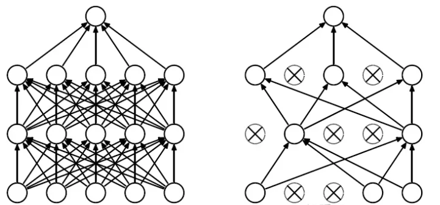

# GPT原理

## 输入数据和标签数据是什么?

假设训练数据集是: '我在尚硅谷学编程'.

`block_size`为3的话.

那么输入数据和标签数据的对应如下:

'我在尚' ----> '在尚硅'

'在尚硅' ----> '尚硅谷'

'尚硅谷' ----> '硅谷学'

'硅谷学' ----> '谷学编'

'谷学编' ----> '学编程'

然后根据以上5条训练数据训练一个GPT模型出来.

## 推理过程是怎么样的?

当我们的提示(prompt)文本是: '我'时, 也就是针对训练好的GPT模型输入'我'时, 发生了什么呢?

GPT模型会根据'我'这个字来预测下一个字是什么? 假设下一个概率最高的字是'在', 那么再将'在'这个字拼接到'我'字后面.

然后再将'我在'作为模型的输入, 预测下一个字. 假设下一个概率最高的字是'尚', 那么再将'尚'这个字拼接到'我在'后面.

然后再将'我在尚'作为模型的输入, 预测下一个字. 假设下一个概率最高的字是'硅', 那么再将'硅'这个字拼接到'我在尚'后面.

此时提示文本变成了'我在尚硅', 由于block_size是3, 所以提示文本被截断为'在尚硅', 继续作为模型的输入得到下一个字.

如此循环就生成了一段文本. 本质就是个**单词接龙**.

## 重要概念讲解

### 层归一化(LayerNorm)

深层神经网络中, 中间某一层的输入是其之前的神经层的输出. 因此, 其之前的神经层的参数变化会导致其输入的分布发生较大的差异. 利用随机梯度下降更新参数时, 每次参数更新都会导致网络中间每一层的输入的分布发生改变. 越深的层, 其输入分布会改变的越明显.

内部协变量偏移(Internal Covariate Shift): 每一层的参数在更新过程中, 会改变下一层输入的分布, 神经网络层数越多, 表现得越明显, (就比如高层大厦底部发生了微小偏移, 楼层越高, 偏移越严重.)

为了解决内部协变量偏移问题, 就要使得每一个神经层的输入的分布在训练过程要保持一致.

层归一化是对一个中间层的所有神经元进行归一化.

### Dropout

在机器学习的模型中, 如果模型的参数太多, 而训练样本又太少, 训练出来的模型很容易产生过拟合的现象. 在训练神经网络的时候经常会遇到过拟合的问题, 过拟合具体表现在: 模型在训练数据上损失函数较小, 预测准确率较高; 但是在测试数据上损失函数比较大, 预测准确率较低.

过拟合是很多机器学习的通病. 如果模型过拟合, 那么得到的模型几乎不能用. 为了解决过拟合问题, 一般会采用模型集成的方法, 即训练多个模型进行组合. 此时, 训练模型费时就成为一个很大的问题, 不仅训练多个模型费时, 测试多个模型也是很费时.

Dropout可以作为训练深度神经网络的一种技巧供选择. 在每个训练批次中, 通过忽略一半的特征检测器(让一半的隐层节点值为0), 可以明显地减少过拟合现象. 这种方式可以减少特征检测器(隐层节点)间的相互作用, 检测器相互作用是指某些检测器依赖其他检测器才能发挥作用.

Dropout说的简单一点就是: 我们在前向传播的时候, 让某个神经元的激活值以一定的概率p停止工作, 这样可以使模型泛化性更强, 因为它不会太依赖某些局部的特征, 如图所示.

左边的图是标准的神经网络. 右边的图是应用Dropout技巧之后的神经网络.